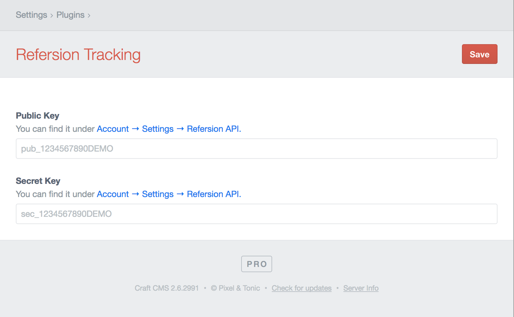

# Refersion Tracking plugin for Craft CMS

Implement Server-side JSON Webhook for Refersion

## Installation

To install Refersion Tracking, follow these steps:

1. Download & unzip the file and place the `refersiontracking` directory into your `craft/plugins` directory
2.  -OR- do a `git clone https://github.com/cavellblood/refersiontracking.git` directly into your `craft/plugins` folder.  You can then update it with `git pull`
3.  -OR- install with Composer via `composer require cavellblood/refersiontracking`
4. Install plugin in the Craft Control Panel under Settings > Plugins
5. The plugin folder should be named `refersiontracking` for Craft to see it.  GitHub recently started appending `-master` (the branch name) to the name of the folder for zip file downloads.

Refersion Tracking works on Craft 2.4.x and Craft 2.5.x.

## Refersion Tracking Overview

Refersion Tracking sends a JSON webhook to the Refersion API with information about the customer&rsquo;s order.

## Configuring Refersion Tracking

* **Public Key** - Enter your Refersion Public Key. It can be found under your Refersion Account &rarr; Settings &rarr; Refersion API. If you don&rsquo;t have an API key you may need to generate a new one.
* **Secret Key** - Enter your Refersion Secret Key. It can be found under your Refersion Account &rarr; Settings &rarr; Refersion API. If you don&rsquo;t have an API key you may need to generate a new one.

## Using Refersion Tracking

-Insert text here-

## Refersion Tracking Roadmap

Some things to do, and ideas for potential features:

* Allow public and secret keys to be configured via `refersionTracking.php` file which could be set to environmental variables.

Brought to you by [Cavell L. Blood](https://cavellblood.com)
